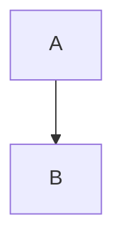

# 我的笔记 & 知识系统

   > 并不是能够记住所有细节的知识才可以叫做自己的知识，一些情况下只要知道去哪里查到，能够迅速索引到这个知识，这些知识也可以称作是自己的知识。

## 流程篇

## 工具篇

- MWeb: Markdown编辑器

    也试用过其它的markdown编辑器，比如Ulysses, Bear。功能都没有MWeb的多。

    MWeb的功能包括:

    - 图片可以拖拽式嵌入文章，并且自动调整为固定大小的缩略图
    - 支持完整的Markdown语法，以及很多的绘图语法扩展
    - 只是上传到很多第三方服务，比如印象笔记，wordpress，语雀
    - 可以生成静态网站（但是我还没用过）

    MWeb的不足之处在于:

    - UI算不上美观
    - 不支持VI Mode（这点对我来说很重要）

- 印象笔记: 个人知识管理系统

    几年使用印象笔记的体验不是很好，因为感觉UI太复杂了，而且不支持markdown，那个富文本编辑器看着很啰嗦。

    2019年我根据少数派一些文章得到提示，印象笔记的真正作用是用来构建自己的个人WIKI。

    个人WIKI的严格定义我不知道，广义的WIKI大家应该都是知道的，针对一个特定的知识做记录，不同的WIKI之间可以连接起来。

    编程领域细碎的知识太多了。很多人说编程是理科，需要很多数学知识。我反而觉得至少当前阶段的编程领域更多属于文科（ruby作者也是这个观点），
    你需要知道使用各种的轮子，也就是需要记住各种轮子的概念和用法。

    **印象笔记最重要的功能就是它可以接受第三方数据的导入，可以对网页文章进行剪裁保存，可以为文章打上各种标签，有强大立体的搜索系统**

- VSCode: Markdown编辑器

    VSCode并不是一个专门的markdown编辑器，但是通过插件可以让它达到我的需求，**最重要的是，它支持VI Mode**。

    在VSCode中我下载了2个插件:

    - VIM: 可以使用VI Mode
    - EverMonkey: 可以在VSCode中编写文章，然后上传到印象笔记